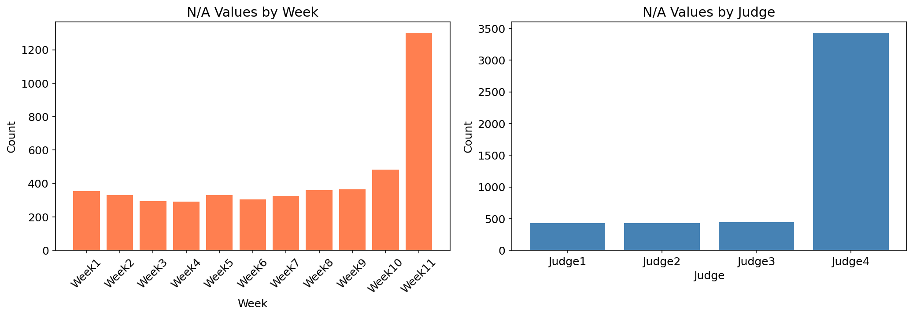

# DWTS 数据预处理报告

## 1. 数据概览

### 1.1 原始数据文件

| 文件 | 说明 | 形状 |
|------|------|------|
| `2026_MCM_Problem_C_Data.csv` | 主数据（评委打分、选手信息） | 421行 × 53列 |
| `pageviews_s21_s34.csv` | 维基百科页面浏览量（S21-S34） | 184行 × 7列 |
| `pro_dancer_stats.csv` | 专业舞者统计 | 61行 × 10列 |
| `season_metadata.csv` | 季节元数据 | 34行 × 7列 |

### 1.2 关键统计量

| 指标 | 值 |
|------|------|
| 总季数 | 34 |
| 总选手数 | 421 |
| 总选手-周次记录 | 2,777 |
| 平均评委得分 | 7.90 (std=1.46) |
| 平均每季选手数 | 12.4 |
| 平均每季周数 | 9.9 |
| 选手平均年龄 | 38.8 (14-82) |
| 行业类别数 | 26 |
| 专业舞者数 | 60 |

---

## 2. 数据质量分析

### 2.1 缺失值分析

**N/A值类型**（共4,741个）：
1. **Judge4打分缺失**：大多数季只有3位评委，Judge4为空
2. **后期周次缺失**：短季节或选手早期淘汰导致后续周次无记录

**0分含义**：选手被淘汰后的周次记录为0（非真实表演得分）

### 2.2 缺失值处理策略

| 变量类型 | 缺失原因 | 处理策略 |
|---------|---------|----------|
| Judge4打分 | 该周无第4评委 | 保留NA，计算总分时忽略 |
| 后期周次打分 | 季节已结束/选手淘汰 | 保留NA，按实际周次处理 |
| 0分 | 选手已淘汰 | 不参与有效打分计算 |
| homestate | 非美国选手 | 填充为'Non-US' |

---

## 3. 数据转换

### 3.1 宽格式 → 长格式

原始数据每行包含一个选手的所有周次得分（宽格式），转换为每行一个选手-周次记录（长格式），便于分析。

**转换规则**：
- 仅保留有效得分（非NA、非0）
- 记录每周的评委数量、总分、平均分、标准差

### 3.2 新增特征

#### 长格式数据特征

| 特征名 | 说明 | 用途 |
|--------|------|------|
| `total_score` | 当周评委总分 | 基础指标 |
| `avg_score` | 当周评委平均分 | 标准化比较 |
| `judge_rank` | 当周评委排名 | 排名法计算 |
| `judge_score_pct` | 当周得分占比 | 百分比法计算 |
| `judge_rank_pct` | 排名百分位 | 相对位置 |
| `score_vs_week_avg` | 与当周均值差 | 相对表现 |
| `cumulative_avg_score` | 历史累积均分 | 趋势分析 |
| `is_eliminated` | 是否被淘汰 | 约束条件 |
| `actual_voting_method` | 实际采用的投票方式 | 方式比较 |
| `is_controversial` | 是否争议选手 | 案例分析 |

#### 季汇总数据特征

| 特征名 | 说明 | 用途 |
|--------|------|------|
| `weeks_competed` | 参赛周数 | 生存分析 |
| `avg_judge_score` | 季平均得分 | 整体表现 |
| `avg_weekly_rank` | 平均周排名 | 相对表现 |
| `pro_avg_placement` | 舞者历史平均名次 | 舞者影响 |
| `total_pageviews` | 维基页面浏览量 | 人气指标 |
| `age_group` | 年龄分组 | 因素分析 |
| `pro_experience_level` | 舞者经验等级 | 舞者影响 |

---

## 4. 投票方式规则

### 4.1 规则变更历史

| 季数 | 投票方式 | 说明 |
|------|---------|------|
| 1-2 | 排名法 | 评委排名 + 观众排名 |
| 3-27 | 百分比法 | 评委得分% + 观众投票% |
| 28-34 | 排名法 | 恢复排名法，新增评委淘汰投票 |

### 4.2 争议案例

| 选手 | 季数 | 争议点 |
|------|------|--------|
| Jerry Rice | 2 | 5周最低分仍获亚军 |
| Billy Ray Cyrus | 4 | 6周最低分仍获第5 |
| Bristol Palin | 11 | 12次最低分仍获季军 |
| Bobby Bones | 27 | 持续低分仍夺冠 |

---

## 5. 输出文件

### 5.1 文件说明

| 文件名 | 说明 | 形状 | 用途 |
|--------|------|------|------|
| `data_long_format.csv` | 长格式数据 | 2,777 × 27 | 问题一、二 |
| `data_season_summary.csv` | 季汇总数据 | 421 × 29 | 问题三 |
| `data_eliminations.csv` | 淘汰记录 | 319 × 8 | 验证约束 |

### 5.2 可视化图表

1. `fig1_na_distribution.png` - N/A值分布
2. `fig2_contestants_per_season.png` - 每季统计（选手数、周数、评委数、得分分布）
3. `fig3_industry_distribution.png` - 行业与年龄分布
4. `fig4_placement_vs_score.png` - 名次与得分关系
5. `fig5_controversial_analysis.png` - 争议选手分析
6. `fig6_pro_dancer_impact.png` - 专业舞者影响

---

## 6. 后续建模建议

### 问题一：粉丝投票估算
- 使用`data_long_format.csv`
- 基于淘汰约束进行贝叶斯推断/约束优化
- 验证：估算的投票是否导致正确的淘汰顺序

### 问题二：投票方式比较
- 使用长格式数据模拟两种投票方式
- 分析争议选手在不同方式下的结果差异
- 考虑第28季后的评委淘汰投票规则

### 问题三：因素影响分析
- 使用`data_season_summary.csv`
- 建立混合效应模型（选手嵌套在季中）
- 分析年龄、行业、舞者等因素的影响

### 问题四：新系统设计
- 综合使用所有数据
- 设计平衡评委专业性与观众参与度的新机制
- 量化公平性和观众吸引力
