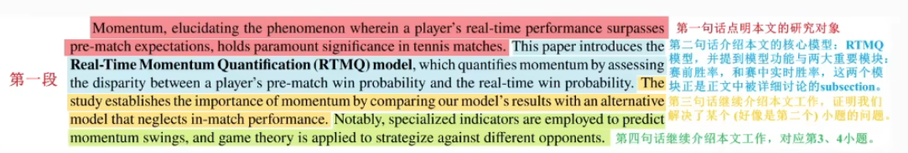
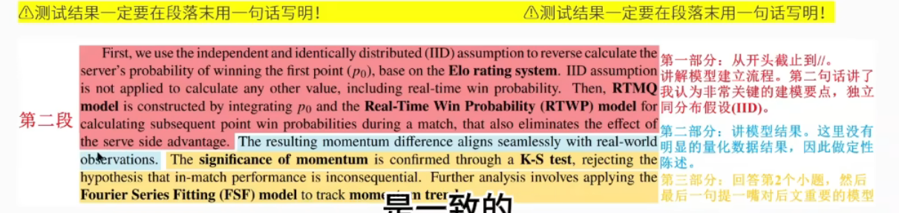
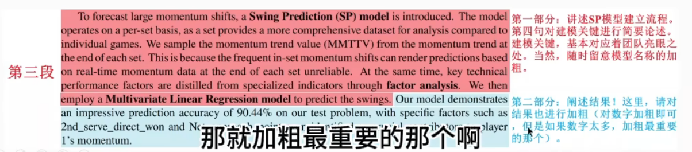
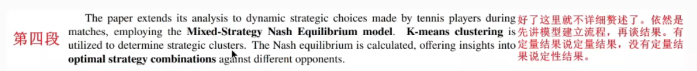
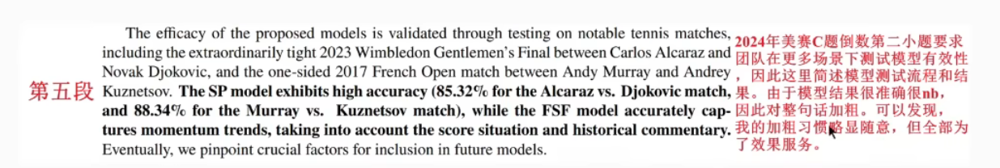
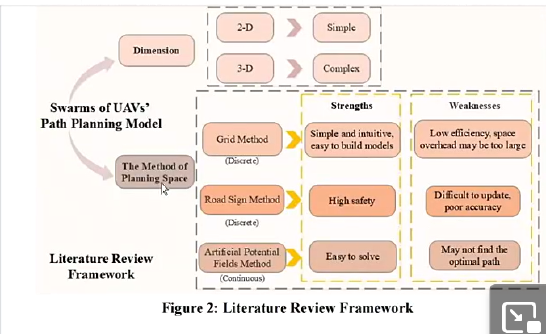
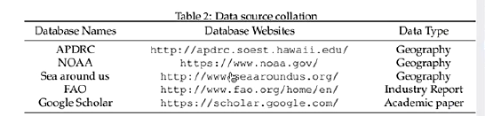
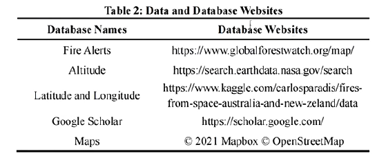
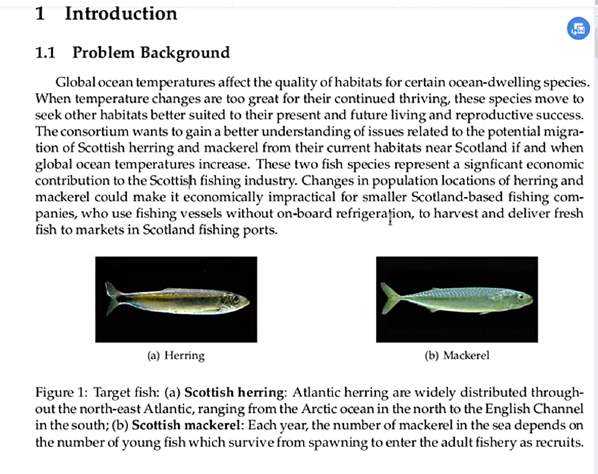

# 论文架构
## 摘要 Abstract
1.  时间：在正文主体部分（所有模型和结果）写完之后，花2h以内回过头来写
2.  应该由全队一起逐词逐句读一到三遍，确定无逻辑问题
3.  扔给gpt进行表述、用语的优化【注意prompt】
4.  具体要求
    - 第一段：第一句话（最长两句）讲问题背景，即本文拟解决的问题。剩下的内容请用最简练、信息密度最高的表述，概括本文的工作（根据什么原理、建立了什么模型、做了哪些验证与测试）
    - 第2~n-1段
        1.  首先介绍每个模型的**建立流程**：用简洁、清晰、信息密度高的表述介绍建模的流程和团队认为非常关键的建模要素
        2.  最后，简述模型的**结果**❗一定要在段末用一句话写明❗【结果（数字）加粗】
        3.  加粗最重要的结果数据
    - 第n段
        1.  再次总结文章工作与结果
        2.  或者，在美赛某个小题的要求下，讲解更多的测试和验证【模型名称/粗略组合加粗】
> TEMPLATE
    背景
    3/several models are established
    Before all the models
    For model 1:xxx,the results are ...
    For model 2
    For model 3
    In addition,模型适用xx
    敏感性、稳定性分析
    推而广之，到社会现实
    KEY WORDS:模型、背景主题、评估、sensitivity analysis

## Introduction 部分
1.  **Problem Background**
    - 给图，少一大段文字
    - 问题背景最好可以引用1-2处数据或者文献，增加文章可信度
2.  **Restatement of the Problem**
    - 根据题目的任务用自己的话复述
    - 切记不能照抄题目的问题
    - 问题重述需要分不同问题有条理的罗列
3. (Literature Review) 文献综述
    - 多些参考文献，让文章看起来有依据，同时获得思路
    - 最好加图 Literature Review Framework（类似our work 的flow chart）
    - 示例：
4.  **我们的工作（个人更喜欢写Our Approach）**
    - 针对不同任务，描述我们建立了什么模型/算法，解决了什么问题
    - 流程图（展示文章的整体脉络）：流程图较为重要，尽量做到清晰美观
    - 我们的工作需要分不同问题有条理的罗列

## Assumptions and Explanations（美赛重点关注）
- 每个Assumption辅之以一个Justification / explanation

## Model Preparation 模型准备
1.  **Notations**
2.  **The Data**
    - Data collection OR Data Overview
      - 示例表1：
      - 示例表2：
    - Data cleaning 

## 模型
- 一个问题/一个模型 一章节
1.  **模型建立**
    - 数据分析与处理（因篇幅限制常跳过）
    - 模型简单介绍
    - 涉及的公式：怎么得出来的 ￫ 公式 ￫ 公式内的符号代表？解释
2.  **结果分析**：重要
    - 结果 图表展示 ￫ 代表啥意思
3.  **模型检验**：稳定性Robustness、敏感性分析
4.  **未来展望**（针对模型，有篇幅再考虑写）
5.  **模型评价**
    - 模型优缺点：差不多两三点，eg.优点四条，缺点两条
    - 缺点写“Possible Improvements”（更好听😁）
    - 有余力有篇幅￫写未来拓展方向

## References参考文献
- 半页左右篇幅，不够也得凑够

## 附录
- 部分没有篇幅在文章中展示的表格/图表
- 按实际情况看放不放代码，对代码比较有信心再附上

## chores
1.  目录尽量放一页，三级标题可以不放进去
2.  真的有这种figure的caption弄一坨描述，一起放caption里的🫤
3.  分点格式：可用小黑点（美赛常用 无序列表），不用1234
4.  公式，辅之以文字，公式中notes的含义解释（对应题目实际具体结合）一定要有
>TEMPLATE: 
..., where xxx变量 represents xxx
xxx is xxx
5. 算法描述：伪代码；算法流程图；文字  最好结合着来用
6. python跑出来的图中可以再用箭头标出来做一些解释

Expt:
> The results shows that model can still keep thier high effectiveness. In other words, our models have high stability, high error-tolerant rate and extensive applicability.

